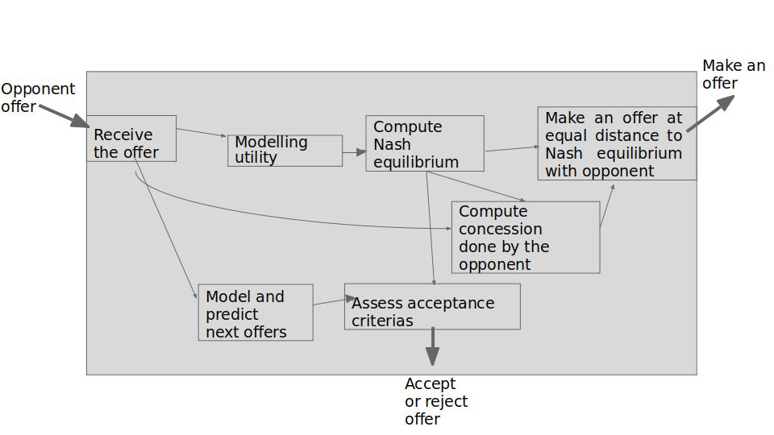

# Automated_negotiation

This project is a simulation of an agents-based automated negotiation, developed within the framework of the python library _NegMAS_. The goal of automated negotiation between two autonomous agents is to find an agreement where each agent's goal is to maximise their utility.
In this project, we consider two agents, without mediation, withing the BOA (Bidding-Opponent-Acceptance) architecture (Baarslag & al., [2016](https://link.springer.com/book/10.1007/978-3-319-28243-5)).  
  
Here are the choices made for modelling the behaviour of our agent :  
  
- <ins>Modelisation of the opponent :</ins>
  
The utility is modelised thanks to bayesian learning, as in (Hindriks & al., [2008](https://www.researchgate.net/publication/221454172_Opponent_modelling_in_automated_multi-issue_negotiation_using_Bayesian_learning)).  
We consider a regression on the time series of the historical proposals of the opponent to make predictions on its next moves and to make an offer, based on the probabilistic approach of gaussian process regression of (Baarslag & al., [2015](https://ieeexplore.ieee.org/document/7397359)).
  
- <ins>Offer strategy modelling :</ins> 
  
The concessions are computed based on the current estimation of Nash equilibrium as the maximum of the product of both utilities. For each round, we have :  
    - The best utility of the agent is computed  
    - We compute Nash equilibrium based on the previous offer of the opponent and compare it with the utility given by the previous offer of the opponent  
    - The agent makes an offer at the same distance, with respect to its utility, and consider the offer with the best utility for the opponent.  
  
- <ins>Acceptance strategy modelling :</ins>
  
Acceptance scenarios :  
    - Accept the offer if the utility of the offer is above a given threshold (9 here), as the proposal is above our expectations so it is no longer needed to negotiate.  
    - In case the negotiation reaches the last offer, accept if the utility is above a given threshold (3 here), as it is better to accept the last one in this context.  
    - Accept the offer if the time t is above a certain threshold and if we do not predict better offers on the next rounds, if the utility is above the minimum threshold of 3. There is no need here to wait for the last round.  
Refuse otherwise.  
  
## Architecture

The steps of the negotiation are as follows :

## Instructions for installation

Install required version of negmas to run the code, here version 0.7.0 is required. The command line "pip install -r requirements.txt" installs the correct version of the module.